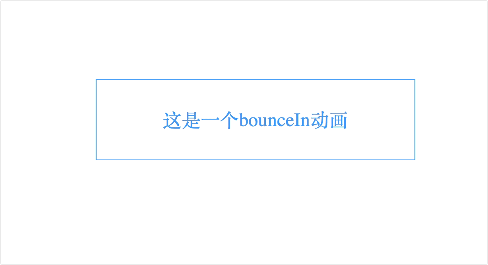
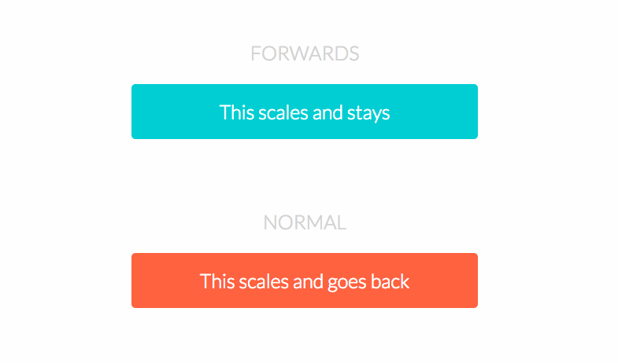

# CSS3动画初识
CSS 动画由两个基本块构成
1. Keyframes - 关键帧
2. Animation Properties - 动画属性

### 关键帧(Keyframes)
关键帧是CSS动画的基础，在每个阶段的动画时间轴定义动画的样子

每个`@keyframes`由以下部分组成
1. `动画的名称`：描述动画的名称，如`bounceIn`
2. `动画的阶段`：动画的每个阶段都用百分比表示，`0%`代表了动画的开始状态，`100%`代表了动画的结束状态，此外还可以添加多个中间状态
3. `动画的属性`：在每个动画阶段定义的css属性

一个简单的`@keyframes`例子，这个`@keyframes`有三个阶段，在第一阶段(`0%`)，元素为完全透明和10%的缩放大小，在第二阶段(`60%`)，元素消失完全不透明和120%的缩放大小，在最后阶段(`100%`), 元素返回默认大小
```css
@keyframes bounceIn {
  0% {
    transform: scale(0.1);
    opacity: 0;
  }
  60% {
    transform: scale(1.2);
    opacity: 1;
  }
  100% {
    transform: scale(1);
  }
}
```

### 动画属性
动画属性用来做两件事
- 分配`@keyframes`到需要发生动画的元素中
- 定义如何动画（有点拗口，但就是这么个意思。。。）

添加动画属性到CSS选择器(或元素), 必须添加以下两个动画属性来使动画生效:
- `animation-name`：动画的名称，由`@keyframes`定义
- `animation-duration`：动画的持续时间, 以秒为单位(如：5s)或毫秒(如：200ms)。

举个栗子🌰：

使一个div发生上面定义的`bounceIn`动画：
```css
div {
  animation-duration: 2s;
  animation-name: bounceIn;
}
```
也可以用`animation`属性简写：
```css
div {
  animation: bounceIn 2s;
}
```
举个实栗🌰：



### 动画属性简写
每个动画属性都可以单独定义，但是为了使代码更清晰简洁，建议使用简写方式：

```txt
animation: [animation-name] [animation-duration] [animation-timing-function] [animation-delay] [animation-iteration-count] [animation-direction] [animation-fill-mode] [animation-play-state];
```
需要注意参数顺序，并且前两个参数为必须的

### 浏览器前缀

许多基于Webkit的浏览器仍然使用-webkit-prefixed版本的动画,关键帧和转换

```css
div {
  -webkit-animation-duration: 2s;
  animation-duration: 2s;
  -webkit-animation-name: bounceIn;
  animation-name: bounceIn;
}
```
```css
@-webkit-keyframes bounceIn { /* styles */ }
@keyframes bounceIn { /* styles */ }
```
在他们采用标准版之前, 需要将-webkit前缀加入

### 其他动画属性

除了必需的`animation-name`和`animation-duration`动画属性, 还可以进一步自定义和创建复杂的动画:

- `animation-timing-function`
- `animation-delay`
- `animation-iteration-count`
- `animation-direction`
- `animation-fill-mode`
- `animation-play-state`

#### Animation-timing-function

`animation-timing-function` 定义了动画的速度曲线, 默认值：`ease`

```txt
animation-timing-function: value;
```
预设值：
- `linear`: 动画从头到尾的速度是相同的
- `ease`: 默认。动画以低速开始，然后加快，在结束前变慢
- `ease-in`: 动画以低速开始
- `ease-out`: 动画以低速结束
- `ease-in-out`: 动画以低速开始和结束
- `cubic-bezier(n,n,n,n)`: 在 cubic-bezier 函数中自定义值。n可能是从 0 到 1 的数值

#### Animation-Delay

`animation-delay`属性定义动画何时开始,  值为秒(如：5s)或毫秒(如：200ms)

注意： 允许负值，-2s 使动画马上开始，但跳过 2 秒进入动画

```css
div {
  animation-delay: 5s;
}
```

举个实栗🌰：


#### Animation-iteration-count

`animation-iteration-count` 属性定义动画的播放次数

预设值：
- #：数值，表示循环次数，默认为1
- infinite： 无限循环

举个实栗🌰：


#### Animation-direction

`animation-direction` 属性定义是否应该轮流反向播放动画, 如果 `animation-direction` 值是 `"alternate"`，则动画会在奇数次数（1、3、5 等等）正常播放，而在偶数次数（2、4、6 等等）向后播放

注意： 如果把动画设置为只播放一次，则该属性没有效果

预设值：
- `normal`: 默认值。动画正常播放，在每个循环动画开始重置状态(0%)然后再到(100%)。
- `reverse`: 反向播放，在每个循环动画重置到最终状态(100%)然后再到(0%)。
- `alternate`:  动画轮流正向反向播放，动画从0%到100%然后再从100%到0%，循环往复播放。
- `alternate-reverse`: 动画轮流反向正向播放，动画从100%到0%然后再从0%到100%，循环往复播放。

css语法：
```txt
animation-direction: alternate;
```

举个实栗🌰：


### Animation-fill-mode
`animation-fill-mode` 属性规定动画在播放之前或之后，其动画效果是否可见
- `none`: 不改变默认行为
- `forwards`: 当动画完成后，保持最后一个属性值（在最后一个关键帧中定义)
- `backwards`: 在 `animation-delay` 所指定的一段时间内，在动画显示之前，应用开始属性值（在第一个关键帧中定义）
- `both`: 向前和向后填充模式都被应用


举个实栗🌰：


### Animation-play-state
`animation-play-state`属性规定动画正在运行还是暂停

语法：
```txt
animation-play-state: paused|running;
```

预设值：
- `paused`:
- `running`:

举个栗子🌰：
```css
.div:hover {
  animation-play-state: paused;
}
```

举个实栗🌰：

