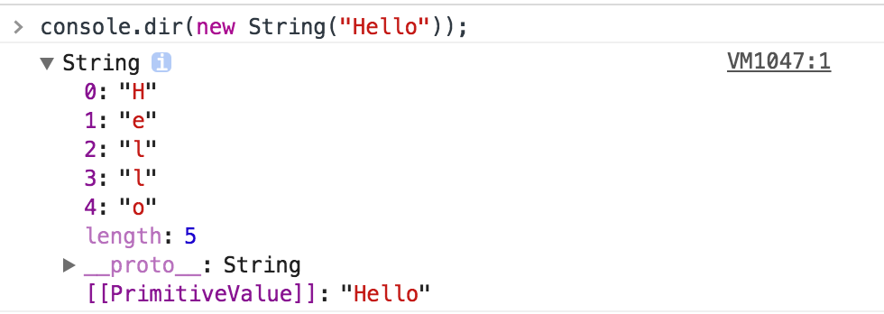
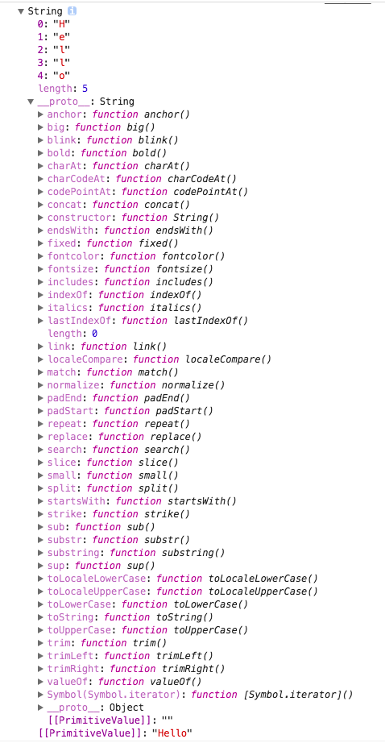
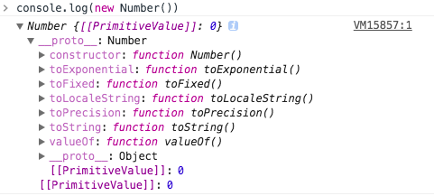
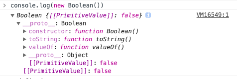

# 基本数据类型详解

目录
===
<!-- TOC -->
- [基本](#基本)
- [String字符类](#String 字符类)
- [Array数组类](#Array 数组类)
- [Number数字类](#Number 数字类)
- [Boolean布尔类](#Boolean 布尔类)
- [Object对象类](#Object 对象类)

<!-- /TOC -->

---

## 基本

通过typeof来检测，得到的数据类型有 string、number、boolean、null、undefined、Object(所有数据的基础)；

ECMAScript中有5种简单的数据类型，也称为基本数据类型；Undefined、Null、Boolean、Number、String, 一种复杂的数据类型，Object(typeof检测还有一种特殊的Function)；

```javascript
console.log(typeof unVar); // undefined，这个变量没有定义,但是不会报错；unVar此时是变量；
console.log(typeof (123)); // number，是一个数字； typeof是操作符而不是方法，所以后面可以加()也可以不加；
console.log(typeof "123"); // string，是一个字符串
console.log(typeof false); // boolean，是一个布尔值
console.log(typeof {});    // object 是一个对象
console.log(typeof null);  // object 是一个对象，在javascript里，null是一个空指针；
console.log(typeof function(){}); // function，是一个方法，也是属于object类型的；
```
---
## String 字符类

为了便于操作基本类型值，ECMAScript 提供了 3 个特殊的引用类型： Boolean 、 Number 和String (注意前面的是大写的，String不是string)。这些类型与引用类型相似，但同时也具有与各自的基本类型相应的特殊行为。实际上，每当读取一个基本类型值的时候，后台就会创建一个对应的基本包装类型的对象，从而让我们能够调用一些方法来操作这些数据。

举个栗子🌰：

```javascript
var tmpString = 'Hello'
tmpString2 = tmpString.indexOf('e')
console.log(tmpString, tmpString2)

// 输出
// Hello 1
```

其实，为了让我们实现这种直观的操作，后台已经自动完成了一系列的处理；第一行的完整写法是
```javascript
var tmpString = new String('Hello')
```
该代码生成了一个String示例，打印该实例
```javascript
console.dir(new String('Hello'));
```


可以看到该示例每一位的值以及长度，默认值为'Hello'，该实例的原型（__proto__）为`String`类，字符串类型(string)是字符串类(String)的一员，继承字符串类的所有属性

继续查看该实例的原型`String`类，看看继承了该类的哪些方法



我们可以看到`String`类的`__proto__`指向了`Object`这个基类，之所以说是基类，是因为`Object.__proto__`是null，已经到顶了

举个栗子🌰:

```javascript
console.dir((new String("Hello")).__proto__); // 输出String类
console.dir((new String("Hello")).__proto__.__proto__); // 输出Object类
console.dir((new String("Hello")).__proto__.__proto__.__proto__); // 输出null
```

再举个栗子🌰：
```javascript
var tmpString = 'Hello'
console.log(tmpString.indexOf('e') // 输出 1
console.log(tmpString.__proto__.indexOf('e')） // 输出 -1， 因为String类的默认值为“”
console.log(tmpString.__proto__.__proto__.indexOf('e')） // 报错，因为没有indexOf这个方法
```

> 引用类型与基本包装类型的主要区别就是对象的生存期。使用 new 操作符创建的引用类型的实例，在执行流离开当前作用域之前都一直保存在内存中。而自动创建的基本包装类型的对象，则只存在于一行代码的执行瞬间，然后立即被销毁。这意味着我们不能在运行时为基本类型值添加属性和方法

Object 构造函数也会像工厂方法一样，根据传入值的类型返回相应基本包装类型的实例。把字符串传给 Object 构造函数，就会创建 String 的实例；而传入数值参数会得到 Number 的实例，传入布尔值参数就会得到 Boolean 的实例。

举个栗子🌰：

```javascript
var obj = new Object("hello");
console.log(obj instanceof String); //true

var obj = new Object(123);
console.log(obj instanceof Number); //true

var obj = new Object(false);
console.log(obj instanceof Boolean); //true
```
> 要注意的是，使用 new 调用基本包装类型的构造函数，与直接调用同名的转型函数是不一样的。

举个栗子🌰：

```javascript
var value = 123;
var string = String(value); // 转型函数
console.log(typeof string); // "string"
var obj = new String(value); // 构造函数
console.log(typeof obj); // "object"
```

---

## Array 数组类

ECMAScript 数组的每一项可以保存任何类型的数据。也就是说，可以用数组的第一个位置来保存字符串，用第二位置来保存数值，用第三个位置来保存对象，以此类推。而且，CMAScript 数组的大小是可以动态调整的，即可以随着数据的添加自动增长以容纳新增数据。

#### 数组的定义

- 构造函数模式
```javascript
var colors = new Array("red", "blue", "green"); // 创建一个包含 3 项，即字符串red", "blue", "green"的数组
var colors = new Array(3); // 创建一个包含 3 项的数组，实际项目中，很少有人这么写；
var colors = Array("red", "blue", "green"); // 构造函数的new是可以省略的；
```
- 数组籽棉量表示法
```javascript
var colors = ["red", "blue", "green"]; // 创建一个包含 3 个字符串的数组
var names = []; // 创建一个空数组
var values = [1,2,]; // 创建一个包含 2 或 3 项的数组
var options = [,,,,,]; // 创建一个包含 5 或 6 个空位的数组
```

在 IE 中， values 会成为一个包含 3 个项且每项的值分别为 1、2 和 undefined 的数组；在其他浏览器中， values 会成为一个包含 2项且值分别为1 和 2 的数组。原因是 IE8 及之前版本中的 ECMAScript 实现在数组字面量方面存在 bug。由于这个 bug导致的另一种情况如最后一行代码所示，该行代码可能会创建包含 5 项的数组（在 IE9+、Firefox、Opera、Safari 和 Chrome 中），也可能会创建包含 6 项的数组（在 IE8 及更早版本中）。在像这种省略值的情况下，每一项都将获得 undefined 值；这个结果与调用 Array 构造函数时传递项数在逻辑上是相同的。但是由于 IE 的实现与其他浏览器不一致，因此强烈建议不要使用这种语法。

在读取和设置数组的值时，要使用方括号并提供相应值的基于 0 的数字索引

举个栗子🌰：

```javascript
var colors = ["red", "blue", "green"]; // 定义一个字符串数组
console.log(colors[0]); // 显示第一项
colors[2] = "black"; // 修改第三项
colors[3] = "brown"; // 新增第四项,如果设置某个值的索引超过了数组现有项数,数组就会自动增加到该索引值加 1 的长度（就这个例子而言，索引是 3，因此数组长度就是 4）
```
#### 数组的length属性

数组的项数保存在其 length 属性中，这个属性始终会返回 0 或更大的值

举个栗子🌰：

```javascript
var colors = ["red", "blue", "green"]; // 创建一个包含 3 个字符串的数组
var names = []; // 创建一个空数组
console.log(colors.length); // 3
console.log(names.length); // 0
```
数组的length不是只读的, 通过设置这个属性，可以从数组的末尾移除项或向数组中添加新项。

举个栗子🌰：

```javascript
var colors = ["red", "blue", "green"];  // 创建一个包含 3 个字符串的数组
colors.length = 2;
console.log(colors[2]); //undefined，此时的colors数组已经被改变了；数组 colors 一开始有 3 个值。将其 length 属性设置为 2 会移除最后一项
colors.length = 10;
console.log(colors[9]); //undefined,虽然 colors 数组包含 2 个项，但把它的 length 属性设置成了 10。这个数组不存在位置 9，所以访问这个位置的值就得到了特殊值 undefined 。
```

利用 length 属性也可以方便地在数组末尾添加新项, 由于数组最后一项的索引始终是 length-1 ，因此下一个新项的位置就是 length 。每当在数组末尾添加一项后，其 length 属性都会自动更新以反应这一变化。

举个栗子🌰：

```javascript
var colors = ["red", "blue", "green"]; // 创建一个包含 3 个字符串的数组
colors[colors.length] = "black"; // （在位置 3 ）添加一种颜色
colors[colors.length] = "brown"; // （在位置 4 )再添加一种颜色
```

## Number 数字类

先举个栗子🌰：
```javascript
console.log(new Number())
```



可以看到 Number 类型重写了 valueOf() 、 toLocaleString() 和 toString()方法，重写后的 valueOf() 方法返回对象表示的基本类型的数值，另外两个方法则返回字符串形式的数值

> 为 toString() 方法传递一个表示基数的参数，告诉它返回几进制数值的字符串形式

```javascript
var num = 10;
console.log(num.toString()); // "10"
console.log(num.toString(2)); // "1010"
console.log(num.toString(8)); // "12"
console.log(num.toString(10)); // "10"
console.log(num.toString(16)); // "a"
```

再看一个栗子🌰：

```javascript
var numberObject = new Number(10);
var numberValue = 10;
console.log(typeof numberObject); // "object"
console.log(typeof numberValue); // "number"
console.log(numberObject instanceof Number); // true
console.log(numberValue instanceof Number); // false
```

在使用 typeof 操作符测试基本类型数值时，始终会返回 "number" ，而在测试 Number 对象时，则会返回 "object" 。类似地， Number 对象是 Number 类型的实例，而基本类型的数值则不是。所以不建议直接实例化 Number 类型。

Number()：
- Boolean转换为数值的时候
  - true转为1
  - flase转为0
- null转换为数值的时候 转换为0
- undefined转换为数值的时候 转为NaN
- string转换为数值的时候
  - 如果只包含数字，转为十进制数，前导0被忽略
  - 如果包含有效浮点格式，转为浮点数值，前导0被忽略
  - 包含有效十六进制格式，转为相同大小的十六进制整数
  - 空字符串转为0
  - 其他格式字符串 转为NaN
- Object 调用对象的valueOf()方法，然后依照前面的规则转换返回的值，如果转换的结果是NAN，则调用对应的toString方法，然后再次依照前面的规则转换返回的字符串值

举个栗子🌰：

```javascript
console.log(Number("hello")); // NaN
console.log(Number("")); // 0
console.log(Number("000011")); // 1
console.log(Number("true")); // NaN
console.log(Number(true)); // 1
```

---

## Boolean 布尔类

先看一个栗子🌰：
```javascript
console.log(new Boolean())
```



可以看到只有2个方法， `toString()`和`valueOf()`并且都是重写Object的方法

boolean数据就是用来判断真假的，而Boolean对象是做为对象来用的，任何非空对象转换的时候，都是true；
> `new Boolean(false)` 这种方法创建的Boolean是true的

看栗子🌰：

```javascript
var falseObject = new Boolean(false);
var result = falseObject && true;
console.log(falseObject,result); //true,因为falseObject会被转为true；因为是当作对象来解析的；
var falseValue = false;
result = falseValue && true;
console.log(falseValue,result); //false

console.log(typeof falseObject); //object
console.log(typeof falseValue); //boolean
console.log(falseObject instanceof Boolean); //true
console.log(falseValue instanceof Boolean); //false
```

---

## Object 对象类

#### 创建方式

*构造函数模式*

```javascript
var person = new Object();
person.name = "zewail";
person.age = "26";
```

*字面量方式*

```javascript
var person = {
  name : "zewail",
  age : "26"
};
```

#### 函数调用
- 点表示法
- 方括号表示法

```javascript
console.log(person["name"]); // "zewail"
console.log(person.name);    // "zewail"
var propertyName = "name";
console.log(person[propertyName]); // "zewail"
```
> 除非必须使用变量来访问属性，否则我们建议使用点表示法
